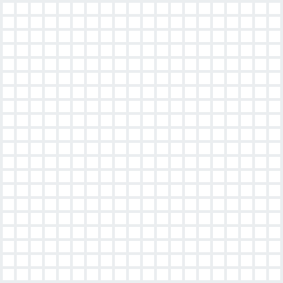
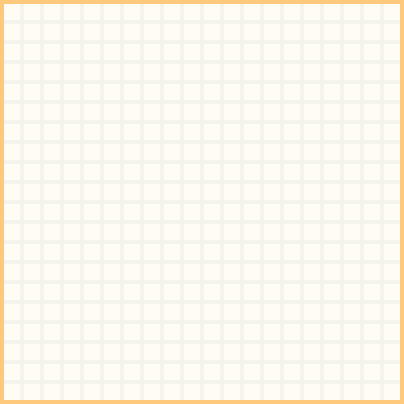
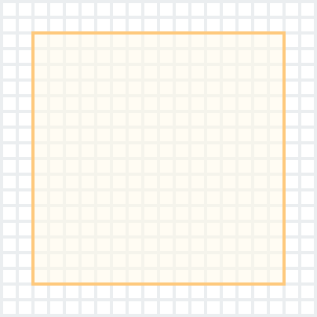

# Polaris icons

Polaris icons is the collective name for our new, cohesive, icon system. As part of the wider drive toward cross-platform unity, this system aims to provide internal teams with the iconographic resources they need to work within the new Polaris design system.

Icons within this system are simple and friendly. Each icon is an exercise in distillation, in taking a metaphor and representing its most basic form.

##### Table of contents
* [Sketch file](#sketch-file)
* [Major and Minor icons](#major-and-minor-icons)
  * [Design](#design)
    * [Major icons](#major)
    * [Minor icons](#minor)
  * [Implementation](#implementation)
    * [React](#react)
    * [Rails](#rails)
  * [Use cases](#use-cases)
    * [Major icons](#major-icons)
    * [Minor icons](#minor-icons)
* [Spot icons](#spot-icons)
* [Naming icons](#naming-icons)
* [Request an icon](#request-an-icon)
* [Questions?](#questions)

## Sketch file

The sketch file contains everything within the Polaris icons system. The `Polaris icons` page contains an alphabetically sorted list of icons within the system, split into `major` and `minor` sections for ease of browsing.

The sketch file can be found in Abstract [here](https://share.abstractapp.com/f348c474-832c-4032-8867-4c84286d8666).

_When using icons, please be sympathetic toward our goal of cohesion and don’t use an icon for a purpose it was not intended for. If you need an icon, please see *Section 3* below._

## Major and Minor icons

Within the system there are 2 distinct icon variants, `major` and `minor` icons. While they are part of the same larger system, they differ in design and implementation and have specific use cases.

### Design

| Base grid | Major grid | Minor grid |
|-----------|------------|------------|
|  |  |  |

#### Major

Major icons are designed on a `20px` by `20px` bounding box. While icons may not use the full height, or width, of the bounding box, they will use as much of the space as is possible (while maintaining correct visual proportions).

Major icons are primarily composed of strokes and have 2 colour variants.

#### Minor

Minor icons are designed on a `16px` by `16px` bounding box.

Minor icons are primarily composed of solid shapes and have a single colour variant.

### Implementation

In **both** cases, icons are exported on a `20px` by `20px` SVG canvas. The reason for this is to make using them in production code as simple as possible. All that’s needed is to identify the type of icon (i.e. `major` or `minor`) without worrying about setting explicit sizing.

#### React

Coming soon.

#### Rails

Coming soon

### Use cases

#### Major icons

Major icons should be used:

* In main navigation in apps, mobile web and web
* To help promote, reinforce, or draw special attention to a specific area or metaphor

Apart from their use in main navigation, major icons are not actionable or clickable.

_In most cases you will use the monotone version of a given icon. The two-tone variant is there for active-states or when specific highlight needs to be given to the icon. Every major icon has 2 variants, regardless of if the two-tone variant has a fill or not._

#### Minor icons

Minor icons should be used:

* Inline, usually accompanying text, to add clarity to an action
* In form elements (`<input>`, `<button>`, etc)

## Spot icons

WIP, more information coming soon.

Our spot icon system was redesigned in August 2018, and as of now (early September 2018), is currently in the process of being rolled out.  Moving forward, any new spot icons will be developed in this new style.

- [Unicorn project](https://unicorn.shopify.io/projects/5221)
- [WIP principles](https://docs.google.com/document/d/1Tq4s_afceREkXeeA5WmfAdScAqfu3AcJCiVXRCqlOsQ/edit)

## Naming icons

The goal of this icon naming strategy is to make icon usage clear. Product area icon names have a single use, whereas generic icons named by functionality or by how they look are a little more forgiving. In most cases, there will be a clear action associated with an icon (add image), but in some, we'll have to support an action or idea by choosing a name that describes how it looks (circle alert). 

### Icons are named three ways:

1. By product area (i.e. home, orders, products, etc)

These icons are explicit, and have a single-application. They shouldn’t be used to symbolize anything other than their product area.

2. By functionality/action (i.e. add image)

3. If an icon has more than one function, we default to naming it by how it looks (i.e. camera, clock)

## Request an icon

Polaris icons will continue to expand just as fast as the rest of the platform, as our needs dictate.

If you’ve identified the need for a specific icon not already present within the icon system:  
**[Request a new icon](https://github.com/Shopify/polaris-icons/issues/new)**

_It is vital that existing icons are not repurposed. Icons are designed, in the vast majority of cases, for a single use. This ensures we don’t start to mix metaphors, and that merchants only ever associate an icon with a single meaning._

## Questions?

If you’ve got any questions, head over to the `#polaris-icons` channel on Slack.
